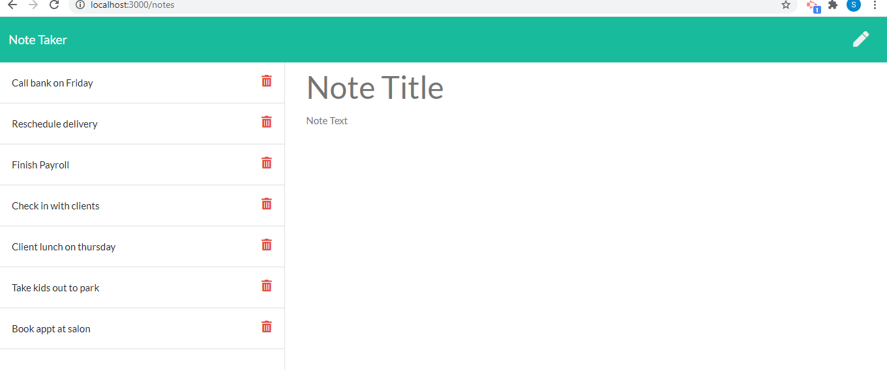

# Note-Taker

## Description

This is an application called Note Taker that can be used to write and save notes. This application will use an Express.js back end and will save and retrieve note data from a JSON file. This application is deployed on heroku cloud.

# Demo

Link for display - https://drive.google.com/file/d/1W1lQQdnWJF-lQvLWj8RL9qO2ffq5fwzK/view



# Deployment
https://radiant-dawn-17273.herokuapp.com/notes

## User Story

```
AS A small business owner
I WANT to be able to write and save notes
SO THAT I can organize my thoughts and keep track of tasks I need to complete
```


## Acceptance Criteria

```
GIVEN a note-taking application
WHEN I open the Note Taker
THEN I am presented with a landing page with a link to a notes page
WHEN I click on the link to the notes page
THEN I am presented with a page with existing notes listed in the left-hand column, plus empty fields to enter a new note title and the note’s text in the right-hand column
WHEN I enter a new note title and the note’s text
THEN a Save icon appears in the navigation at the top of the page
WHEN I click on the Save icon
THEN the new note I have entered is saved and appears in the left-hand column with the other existing notes
WHEN I click on an existing note in the list in the left-hand column
THEN that note appears in the right-hand column
WHEN I click on the Write icon in the navigation at the top of the page
THEN I am presented with empty fields to enter a new note title and the note’s text in the right-hand column
```


# Installation
 * Clone this repository to use this application on local machine.
 * To install necessary dependencies, run the following command :
 `npm i`
 * The application will be invoked with the following command: This will start localhost server on PORT 3000.
 `node index.js`
 * Open browser and type http://localhost:3000/ to run this application on your local machine.


# Usage

The application will be invoked with the following command: This will start localhost server on PORT 3000.
 `node index.js`

# Features
The application should have a `db.json` file on the back end that will be used to store and retrieve notes using the `fs` module.

Used 'Express.js' to build server

Used uuid npm package to give unique id to each note.

The following HTML routes are available

* `GET /notes` should return the `notes.html` file.

* `GET *` should return the `index.html` file.

The following API routes should be created:

* `GET /api/notes` should read the `db.json` file and return all saved notes as JSON.

* `POST /api/notes` should receive a new note to save on the request body, add it to the `db.json` file, and then return the new note to the client. 

* `DELETE /api/notes/:id will delete the requested note when not relevant anymore from the db.json and 
present with the active set of notes.

### Deployment
  Note taker application is deployed on heroku

# Contribution
  Pull requests are always welcome

# Questions
 For any questions on this repo please feel free to raise an issue.    


